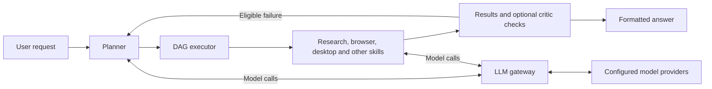

# GraphPilot

*A dynamic DAG orchestrator with a multi-provider LLM gateway.*

A Python framework that plans tasks, runs skills, checks selected results, and returns an answer. It combines a **dynamic DAG orchestrator**, an **LLM gateway**, **browser automation**, and **macOS desktop control**.

A DAG is a graph of tasks and their dependencies, with no cycles. Steps wait for their dependencies; independent steps can run in parallel. The graph can grow during a run as skills add work or the planner responds to a failure.

## How it works

The planner chooses skills and inputs. The executor runs ready steps and collects results. Skills use the gateway for model calls; browser and desktop skills also operate their own control loops. The formatter produces the final answer.



## Features

| Area | What the code supports |
| --- | --- |
| Orchestration | Parallel ready steps, task-specific inputs, and graph expansion during execution using NetworkX and asyncio. |
| Checks and recovery | Automatic critics for marked skills; recovery planning for eligible task failures and rejected outputs. |
| Sessions and memory | Saved graphs and node results, resume, terminal replay, and FAISS memory search with keyword fallback. |
| Skills | YAML configuration and prompt files for planning, research, retrieval, extraction, summaries, and formatting. Tool-using skills call an MCP server. |
| Browser | HTML extraction, supplied selector actions, accessibility-based interaction, and screenshot-based vision fallback. |
| macOS desktop | Accessibility reads, scripted actions, text-model control, Electron DOM control, and vision fallback through `cua-driver`. |
| LLM gateway | Provider selection, automatic failover for unpinned calls, rate limits, retries, tool calls, structured output, batch requests, vision, and embeddings. |
| Visibility | A JSON + SSE API that streams a run as it executes and reads past runs back off disk, terminal replay, the gateway dashboard, and token usage and estimated cost by agent/session. A web console is planned; there is no frontend in the repo yet. |

The gateway supports adapters for Gemini, W&B Inference, Groq, OpenRouter, NVIDIA, and Ollama. Enabled providers depend on your configuration. Note that W&B is metered while the rest are free-tier or local — see [Known gaps](llm_gateway/README.md#known-gaps), because the gateway limits requests and tokens but not spend. The coder prompt is currently a stub; its execution hook runs Python in a subprocess with time and output limits, without full OS isolation.

## Three demos

These are recorded demonstrations, not fresh validation runs of this checkout.

| Video | What it shows |
| --- | --- |
| [DAG orchestration](https://www.youtube.com/watch?v=7seKiAq5N_o) | Planning, parallel work, result checking, and recovery workflows. |
| [Hugging Face browser workflow](https://www.youtube.com/watch?v=74mO8zHaTCM) | Finding text-generation models and building a comparison. |
| [macOS Notes automation](https://www.youtube.com/watch?v=Zgq-_iuWEkM) | Creating a note with the agent cursor overlay enabled. |

## Quick start

Use Python 3.11+ and `uv`. First follow the [dependency setup](docs/dag-orchestrator.md#setup) to run `uv sync` for both the gateway and agent.

Create a `.env` file at the repository root with your provider key. Gemini is used by most default skills:

```dotenv
GEMINI_API_KEY=your-key
EMBED_ORDER=gemini
```

This embedding setting keeps memory on one configured model. Additional providers and routing options are in the [gateway guide](llm_gateway/README.md).

Start the gateway in one terminal, from the repository root:

```bash
cd llm_gateway
uv run python main.py
```

Run a basic task in another terminal, also starting at the repository root:

```bash
cd agent
uv run python flow.py "Say hello in one short sentence."
```

The gateway dashboard is at <http://localhost:8109>. Use `flow.py --interactive` for repeated queries.

**Or drive it over HTTP.** `cd agent && uv run python api.py` serves a JSON API
on <http://localhost:8110>: `POST /api/runs` starts a run,
`GET /api/runs/<id>/events` streams it as server-sent events, and
`GET /api/sessions` reads past runs. It starts the gateway itself if it is not
already up.

**Browser tasks:** install Playwright Chromium using the [browser guide](docs/browser-automation.md). Web research optionally reads `TAVILY_API_KEY` from the root `.env`; search falls back to DDGS.

**Desktop tasks:** require macOS, the `cua-driver` CLI/CuaDriver app, and Accessibility and Screen Recording permissions. Follow the [computer-use guide](docs/computer-use.md), then start the daemon and Notes example from the repository root:

```bash
open -n -g -a CuaDriver --args serve
cd agent
uv run python -m computer.tasks.task_notes
```

These examples operate the host desktop.

## Guides

- [DAG orchestration, setup, recovery, and replay](docs/dag-orchestrator.md)
- [Browser workflow and artifacts](docs/browser-automation.md)
- [Computer use, desktop examples, and recordings](docs/computer-use.md)
- [LLM gateway configuration and API](llm_gateway/README.md)
